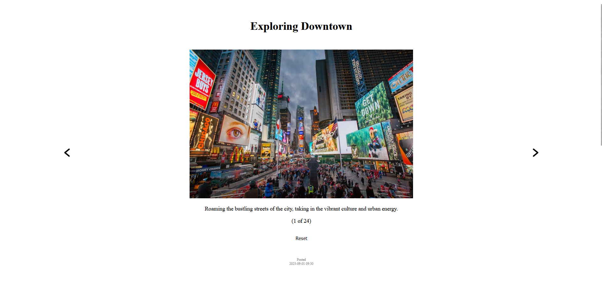

# useStates

We were tasked with creating components where we take advantage of useStates. 
I chose to create a page where the users can browse through a set of template blog posts. By using useState I've made it possible for the users to navigate through each post by simply clicking the left or right arrows on the page. The useState ensures that the post's index value is memorized and it renders the new content upon swapping to a different index value.

I have also added a basic comment section if you would call it that, to utilize the useState with form manipulation. 
The comment section has two input fields, both of which utilizes useState. Each field has a live preview section which is updated and rendered live as the users type in a desired display name and their comment. 

